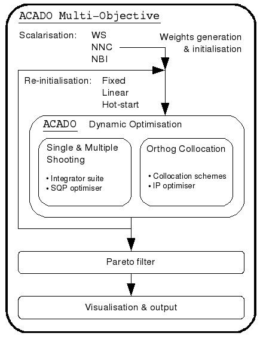

# Manual
Review of `ACADOToolkitUser's Manual`


## 3. Optimal Control Problem (OCP)
ACADO solves OCP iteratively.

### 3.1. Rocket example
Default setting
* multiple-shooting discretization
* sequential quadratic programming (SQP) method
* Runge-Kutta integrator

### 3.2. Initialization
Set initial state. 3 ways.
1. Built-in auto-initialization (default)
    * ACADO uses constraints to initialize.
        * 2 bounds: To mean of constraints
        * 1 bound : To the bound
        * No constraint: To 0
2. From text file
    * ...
3. Use ACADO data structure
    * Needed class : `VariablesGrid`
    * Same with using text file, but hard-coding

### 3.3. Algorithmic options
How to overwrite the default settings
1. Tutorial code
    ```cpp
    algorithm.set(<Option Name>, <Option Value>)
    ```
    * Exception : the number of intervels
    * which are specified in the constructor of OCP
    * following the definition of the time interval.
2. Common Algorithmic options
    * ...

### 3.4. Storing the results
How to obtain and store the numerical results of optimization algorithm
1. In a text file
    * Easiest way
    * Similar to initializing via text file
2. In form of ACADO data structure
    * In form of `VariablesGrid`
    * Obtained results can be used directly in C++
3. By the logging functionality of ACADO
    * Set `LogRecord`.
    * Specify information to be logged.
    * After running, it can be used directly in C++.

### 3.5. DIfferential algebraic systems (DAE for eq.)
The model equation contains not only differential, but also algebraic states.
1. Mathematical formulation
2. Tutorial code for Semi-implicit DAEs

### 3.6. Discrete-time system
How to setup OCPs for discrete time systems.
1. Mathematical formulation
2. Implementation in ACADO syntax
    ```cpp
    f << next(s) == s + h*v
    ```


## 4. Multi-Objective Optimization (MOOCP)
Multi-Objective Optimal Control Problems (MOOCPs) give rise to a set of Pareto optimal solutions instead of one single optimum.

### 4.1. Introduction to MOOCPs
1. Mathematical formulation
    * m objectives is minimized
2. Concepts and philosophy
    * Pareto optimality concept : 
        * there exist no other feasible point that improves one of the objectives without worsening at least one of the other objectives
    * Scalarization methods : 
        * convert the original multi-objective optimization problem into a series of parametric single objective optimization problems. 
        * Pareto front is obtained
3. implementation
    * 

### 4.2. Static Optimization Problem with Two Objectives
Static : variables and constraints are constant over time. Use NLP.
1. Mathematical formulation
2. Implementation
    * Setting for multi-objective optimization
        * Scalarization method
        * The number of Pareto points
        * Hot-start re-initialization
        * Pareto filter
3. Numerical result


### 4.3. Static Optimization Problem with Three Objectives

### 4.4. Dynamic Optimization Problem with Two Objectives
Dynamic : variables and constraints change over time. Use OCP.


## 5. State and parameter estimation
### 5.1 Tutorial


## 6. Process for Closed-Loop Simulations
* Built-in simulation environment for perfoming realistic closed-loop simulations. 
* The model used for simulating the process does not need to be the same as specified within the optimal control formulations within
the controller

### 6.1. Setting up
How to setup a simple Process for MPC simulations

### 6.2 Advanced features
In particular, actuator and sensor behaviour can be simulated to yield more realistic results.
1. Adding an actuator to the process
    * Noise, delay
2. Adding a sensor
    * Noise, delay
3. Simulation results
4. Algorithmic options


## 7. Controller for Closed-Loop Simulations
Three major blocks
1. Estimate state/parameter online using output.
2. Reference trajectory can be provided to the control law.
3. Class `ControlLaw` (usually `RealTimeAlgorithm`) uses estimated values to compute optimizedc control inputs.

### 7.1. Setting up MPC controller
How to setup a basic MPC controller
1. Mathematical Formulation
2. Implementation
3. Simulation Results
4. List of Algorithmic Options

### 7.2. Setting-Up More Classical Feedback Controllers
1. PID
2. LQR


## 8. Simulation Environment
### 8.1 Performing a Basic Closed-Loop MPC Simulation
1. Implementation


## 9. Integrators
### 9.1. Introduction
### 9.2. Runge Kutta Integrators
### 9.3. BDF Integrator


## 10. Discretization Methods for Dynamic Systems
work in progress
## 11. NLP Solvers
work in progress


## 12. Matrices and Vectors
### 12.1. Getting Started
```cpp
Matrix A( 3 , 2 ) ;
Vector x (2) , b (3) , c ;
```
1. Read from ASCII-file
2. Store into ASCII-file


## 13. Time and Variables Grids
work in progress
## 14. Differentiable Functions and Expressions
work in progress


## 15. Code Generation
### 15.1. Introduction
How to use the ACADO Code Generation tool
1. Scope
2. Implemented Algorithms
3. Code generated ACADO integrators
4. Limitations regarding the OCP formulations
### 15.2. Getting Started
### 15.3. A Closer Look at the Generated Code
### 15.4. Advanced Functionality
all available user-options
